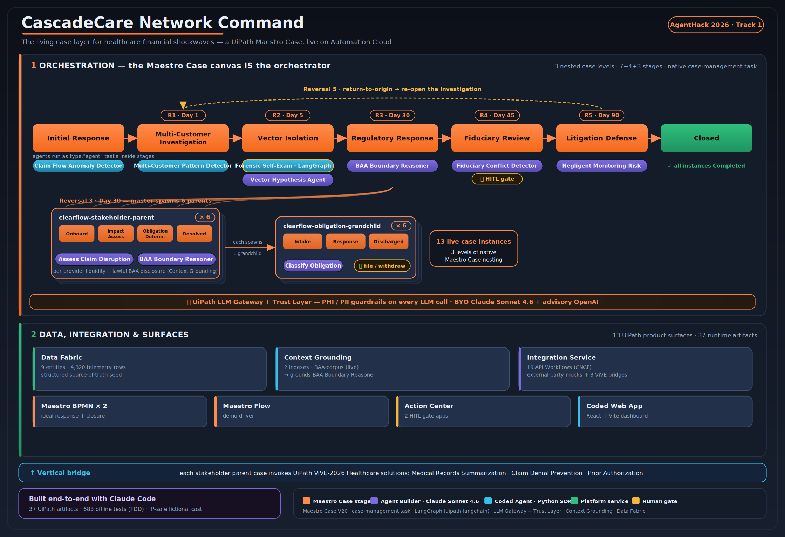
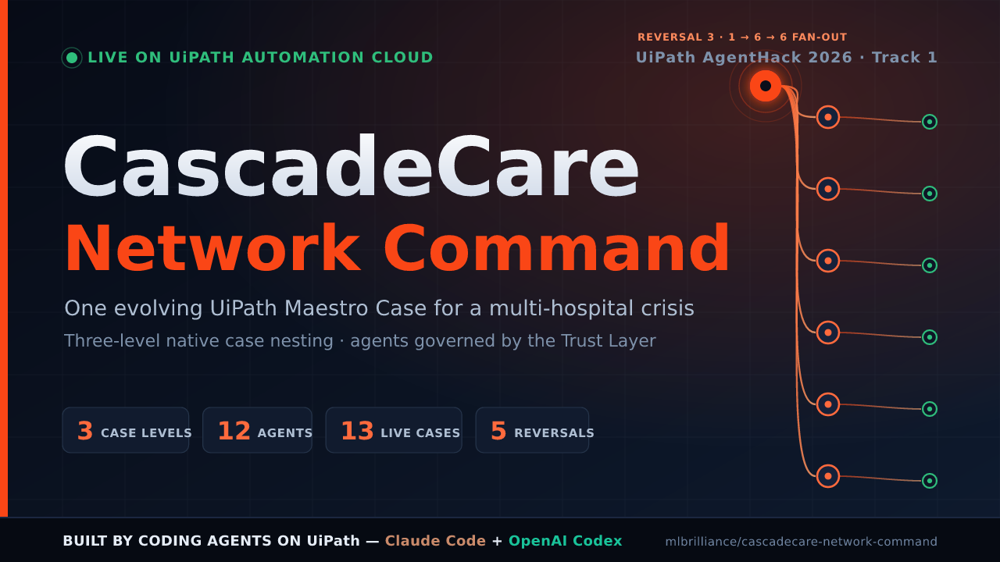

<h1 align="center">CascadeCare Network Command</h1>

<p align="center"><b>The living case layer for healthcare financial shockwaves</b></p>

<p align="center">
A <b>UiPath Maestro Case</b> command center that manages a multi-hospital cyber-payment crisis as <b>one evolving, three-level case</b><br/>
— built for <b>UiPath AgentHack 2026 · Track 1</b>, running live on Automation Cloud.
</p>

<p align="center">
  
  
  
</p>

<p align="center">
  <a href="https://www.uipath.com/"></a>
  <a href="https://github.com/langchain-ai/langgraph"></a>
  <a href="https://www.anthropic.com/"></a>
  <a href="https://claude.com/claude-code"></a>
  <a href="https://openai.com/codex/"></a>
</p>

<p align="center">
  <b>🤖 Built by coding agents on UiPath</b> — <b>Claude Code</b> (primary authorship) <b>+ OpenAI Codex</b> (assist) drove the UiPath <code>uip</code> CLI to author every artifact, test, and spec, test-first.<br/>
  <sub><i>A working proof that UiPath is a first-class target for autonomous coding agents — the AgentHack 2026 coding-agent bonus.</i></sub>
</p>

<p align="center">
  <a href="https://youtu.be/J2gMR2DrzAY"><b>▶ Watch the 5-min demo</b></a> &nbsp;·&nbsp;
  <a href="#-for-judges--start-here"><b>For judges</b></a> &nbsp;·&nbsp;
  <a href="#what-this-is"><b>What it does</b></a> &nbsp;·&nbsp;
  <a href="#demo-five-reversals"><b>Five reversals</b></a> &nbsp;·&nbsp;
  <a href="#exception-failure--edge-case-handling-criterion-3"><b>Exception handling</b></a> &nbsp;·&nbsp;
  <a href="#uipath-component-inventory"><b>Component inventory</b></a> &nbsp;·&nbsp;
  <a href="#built-with-coding-agents"><b>Built with coding agents</b></a>
</p>

<p align="center">
  
</p>

<p align="center"><sub><i>Schematic architecture diagram — three nested Maestro Case levels, 12 agents, the Trust Layer governing every LLM call, and the data / integration foundation. Not live-tenant footage.</i></sub></p>

<!-- TODO(human, high-impact): a real live-run screen-capture (the actual UiPath canvas — Reversal-3 fan-out / forensic agent firing / HITL gate) would be even stronger when the tenant is up. -->


> Three nested Maestro Case levels orchestrate the crisis end-to-end. Agents plug into stages as `type:"agent"` tasks — every LLM call routed through the UiPath LLM Gateway + Trust Layer — while Data Fabric, Context Grounding, and 19 API Workflows feed the case. Authored end-to-end by coding agents — Claude Code (primary) + OpenAI Codex (assist). ([editable SVG source](docs/images/architecture.svg))

---

## 📋 For Judges — Start Here

> A four-point summary covering exactly what AgentHack judging asks for: **what it does**, **which UiPath components it uses**, **which agent types**, and **how to configure and run it**. Each point links to the full detail further down.

### 1 · Project Description — what it does and the problem it solves

**The problem.** When a U.S. healthcare clearinghouse / payment intermediary suffers a cyberattack, the shockwave is not one incident — it is a *cascade*: dozens of hospitals stop getting paid, regulators issue subpoenas, payers demand records, BAAs collide with disclosure demands, and litigation spreads. No two stakeholders face the same obligations, deadlines, or legal exposure, and the situation **mutates** as new facts arrive. Handling this with isolated bots or one-shot agents loses the shared state, the SLA clock, the legal boundaries, and the audit trail.

**What CascadeCare does.** CascadeCare Network Command manages that entire cyber-payment cascade as **one living UiPath Maestro Case** for the fictional **ClearFlow Health Network**. A master crisis case spawns per-stakeholder parent cases, which spawn per-obligation grandchild cases — **three levels of native case nesting** — while **five mid-flight goal reversals** re-route the response across a simulated 90-day timeline. Twelve agents reason inside the case stages, every LLM call governed by the UiPath Trust Layer, with two human-approval gates for the high-stakes decisions. The hero moment: **Reversal 3** (a state DOI subpoena) fans out **six grandchild cases simultaneously** on the canvas. → [What This Is](#what-this-is) · [Five reversals](#demo-five-reversals)

### 2 · UiPath Components — comprehensive list

**13 UiPath product surfaces · 38 runtime artifacts**, all running live on Automation Cloud:

| # | UiPath component | Used for |
|---|------------------|----------|
| 1 | **Maestro Case** (V20, 3-level nesting) | The runtime orchestrator — master → stakeholder-parent → obligation-grandchild (3 `caseplan.json` definitions) |
| 2 | **Maestro BPMN** | 2 process models — incident-response playbook + case-closed notification |
| 3 | **Maestro Flow** | Demo Driver — paces the 90-day reversal timeline to wall-clock |
| 4 | **Agent Builder** (low-code) | 6 reasoning agents, Claude Sonnet 4.6 via BYO-LLM |
| 5 | **Coded Agents** | 6 agents — 4 UiPath Python SDK + **2 LangGraph `StateGraph`** via `uipath-langchain` |
| 6 | **LLM Gateway → Trust Layer** | Governs **every** LLM call; PHI/PII + content guardrails |
| 7 | **Context Grounding** | 2 indexes (`BAA-corpus` bound to the BAA Boundary Reasoner) |
| 8 | **Data Fabric** | 9 entities (~4,320 claim-telemetry rows) + immutable `AuditRecord` ledger |
| 9 | **Action Center** (AppTask) | 2 human-in-the-loop gates (fiduciary review + obligation response) |
| 10 | **UiPath Apps** (Coded Web App) | Live operator command-center dashboard + compliance-ledger panel |
| 11 | **Orchestrator** | Case/agent jobs, hourly janitor trigger, bulk job sweep |
| 12 | **Integration Service** (API Workflows) | 19 mock-front + ViVE-bridge workflows |
| 13 | **Solution** (`.uipx`) | One deployable bundle of every project |

→ Full breakdown: [UiPath Component Inventory](#uipath-component-inventory)

### 3 · Agent Type — Coded Agents **and** Low-Code Agents (both)

CascadeCare uses **both agent types** — **12 agents total**:

- **6 Low-Code Agents** (UiPath **Agent Builder**, `agent.json`) — running **Claude Sonnet 4.6 (BYO-LLM)** through the LLM Gateway: `baa-boundary-reasoner`, `vector-hypothesis-agent`, `fiduciary-conflict-detector`, `negligent-monitoring-risk-agent`, `assess-claim-disruption`, `classify-obligation`.
- **6 Coded Agents** (UiPath **Python SDK**, `agent.py`) — of which **2 are LangGraph `StateGraph` agents** deployed via `uipath-langchain` (`forensic-self-exam-agent-langgraph`, `audit-ledger-writer-langgraph`) and 4 are deterministic Python SDK agents (`claim-flow-anomaly-detector`, `multi-customer-pattern-detector`, `forensic-self-exam-agent`, `case-job-janitor`).

→ Full agent table: [Agent inventory](#agent-inventory-12--6-agent-builder-low-code--6-coded)

### 4 · Setup & Run Instructions — configure and run for judging

There are **two ways to judge this**, easiest first:

#### Option A — Just watch it (no setup, recommended first pass)

- **▶ [Watch the ≤5-minute live demo](https://youtu.be/J2gMR2DrzAY)** — the full three-level cascade running on Automation Cloud, hero fan-out at ~2:30.
- **Live operator dashboard:** [`clearflow-network-command` Coded Web App](https://hackathon26_042.staging.uipath.host/clearflow-network-command) — fire reversals and approve the HITL gate live from the console.

#### Option B — Run it yourself on UiPath Automation Cloud

Everything is already deployed: `clearflow-solution` **1.0.36** → folder `Shared/CascadeCare-v110`. You only ever **start one process** — the master crisis case — and it cascades to *everything else automatically* (children, grandchildren, all agents, all API workflows). Full step-by-step with troubleshooting: **[`docs/DEMO-RUNBOOK.md`](docs/DEMO-RUNBOOK.md)**.

**Reference values (staging tenant):**

| Thing | Value |
|---|---|
| Tenant | `staging.uipath.com` / `hackathon26_042` / `DefaultTenant` |
| Deployment folder | `Shared/CascadeCare-v110` (folder key `de7b7c18-d743-4c8c-b555-9bd3b96fe524`) |
| Master process key | `AC365BA5-C807-4DFC-A009-00F3EA61E497` |

**B1 — Run from the Orchestrator UI (no CLI needed):**
1. Sign in to **`staging.uipath.com`** → org `hackathon26_042` → **DefaultTenant**.
2. Open folder **`Shared/CascadeCare-v110`** → **Automations → Processes**.
3. Find **`clearflow-master-crisis`** and click **Run**. *(This is the only process you start by hand — do not start children, grandchildren, agents, or API workflows; they expect to be spawned with parent context.)*
4. Optionally also run **`clearflow-demo-driver`** (Maestro Flow) alongside it to fire the scripted 5-reversal timeline.
5. Watch the cascade in **Maestro → Monitoring** (master walks 5 agent stages → 6 child cases → 6 grandchild cases).
6. In **Action Center → Tasks** (same folder), click **Approve** on the two HITL gates: **Tri-Party Fiduciary Conflict Review** (master, Reversal 4) and **Prepare & File Obligation Response** (grandchild). The master then reaches **Closed** and fires a Slack close-out.
7. Confirm closure in **Maestro → Monitoring** (the source of truth — *not* the Orchestrator Jobs view, which never flips Maestro case jobs to Successful on this tenant).

**B2 — Run via the `uip` CLI:**
```bash
# 1. Authenticate against the STAGING tenant (plain `uip login` hits the wrong cloud)
uip login --authority https://staging.uipath.com --organization hackathon26_042 --interactive
# (pick DefaultTenant when prompted)

export FK=de7b7c18-d743-4c8c-b555-9bd3b96fe524

# 2. Start ONLY the master crisis case — it cascades to everything else
uip or jobs start AC365BA5-C807-4DFC-A009-00F3EA61E497 --folder-key $FK --output json

# 3. (optional) also start the Demo Driver flow to fire the scripted reversals
#    look up its key, then: uip or jobs start <demo-driver-key> --folder-key $FK

# 4. Watch the three levels come live (MASTER → CHILD → GRANDCHILD jobs)
uip or jobs list --folder-key $FK --output json | grep -c clearflow

# 5. Approve the two HITL gates in Action Center → Tasks (human approval; no CLI shortcut)

# 6. Confirm every instance reached Completed (case instance = source of truth)
uip maestro case instance list --folder-key $FK
```

**Rebuild from source / deploy to a fresh tenant?** See **Path B** in [`docs/DEMO-RUNBOOK.md`](docs/DEMO-RUNBOOK.md) (pack → publish → deploy → activate) and [Prerequisites](#prerequisites) + [Quickstart (build-time)](#quickstart-build-time) below.

---

## What This Is

When a provider goes dark, the payment network feels it first. CascadeCare Network Command shows
how **ClearFlow Health Network** — a fictional US healthcare payment intermediary — manages a
multi-customer cyber cascade as **one evolving Maestro Case**. A master crisis case spawns
per-stakeholder parent cases, which in turn spawn per-obligation grandchild cases — **three levels
of native case nesting** — while five master-level goal reversals reshape the response across a
90-day simulated timeline.

The hero moment: **Reversal 3** (a state DOI subpoena) fans out **six grandchild cases
simultaneously** on the Maestro Case canvas.

> [!IMPORTANT]
> **Live status (2026-06-24).** Every UiPath artifact below is authored, validated against its UiPath
> contract (V20 / CNCF Serverless 1.0.0 / Agent Builder), and **running live on UiPath Automation
> Cloud** — `clearflow-solution` **1.0.36** deployed to `Shared/CascadeCare-v110`, with a full
> cascade run proven end-to-end (master auto-walks all agent stages → 6 child + 6 grandchild cases →
> two HITL gates → master **Completed**). The **LangGraph** Forensic Self-Exam agent fires in-case at
> Vector Isolation and surfaces structured errors on LLM-Gateway failure without faulting (Criterion-3
> defense-in-depth). The operator dashboard is live as the `clearflow-network-command` **Coded Web
> App** at [`…/clearflow-network-command`](https://hackathon26_042.staging.uipath.host/clearflow-network-command).
> Live run procedure: [`docs/DEMO-RUNBOOK.md`](docs/DEMO-RUNBOOK.md). Historical deviations:
> [`DEVIATIONS.md`](DEVIATIONS.md).

## Highlights

|  |  |
|---|---|
| 🧱 **3-level native case nesting** | master crisis → 6 stakeholder parents → 6 obligation grandchildren, wired with the native `case-management` task |
| 🔀 **5 mid-flight goal reversals** | the case re-routes *itself* across a simulated 90-day timeline; Reversal 3 fans out **13 live case instances** in one beat |
| 🤖 **12 agents, 2 frameworks** | 6 Agent Builder (Claude Sonnet 4.6 BYO-LLM) + 6 Coded — 4 Python SDK + **two LangGraph `StateGraph`s** via `uipath-langchain` |
| 🛡️ **Governed by default** | every LLM call routes through the UiPath **LLM Gateway + Trust Layer** (PHI/PII guardrails) |
| 🧯 **Fails safe (Criterion 3)** | 4-layer exception handling — agents degrade instead of crashing; the case keeps moving |
| 🏥 **Regulated-vertical realism** | a real class of healthcare payment-network cyberattack — orchestrating UiPath's own **ViVE-2026** healthcare agents |
| 🟢 **Live on Automation Cloud** | full cascade proven end-to-end — master + 6 + 6 all reach **Completed** |
| 🛠️ **Built with coding agents** | **Claude Code** (primary authorship) + **OpenAI Codex** (assist) — 38 UiPath artifacts + 768 offline tests, authored test-first |

---

## Judging Criteria — Track 1 at a glance

| Criterion | How CascadeCare addresses it | Jump to |
|---|---|---|
| **1 · Real-world applicability** | A regulated-vertical crisis — a healthcare payment-network cyberattack with BAA/PHI boundaries — orchestrating UiPath's own ViVE-2026 healthcare agents under fire | [Why this matters](#why-this-matters--healthcare-is-uipaths-2026-vertical) |
| **2 · Orchestration & multi-agent** | 12 agents across 3 nested case levels; the case progresses *itself*; Reversal 3 fans out 13 coordinated instances | [Component inventory](#uipath-component-inventory) |
| **3 · Exception & edge-case handling** | 4-layer defense-in-depth, authored test-first — agents degrade, the case never crashes | [Exception handling](#exception-failure--edge-case-handling-criterion-3) |
| **4 · Component variety** | 13 UiPath product surfaces · 38 runtime artifacts | [13 surfaces](#uipath-component-inventory) |
| **5 · Presentation** | Live ≤5-min run + a Criterion-3 supplemental clip; this README + architecture diagram | [Demo video](#demo-video) |
| **Bonus · Coding agents (+2)** | Two coding agents on UiPath — **Claude Code** (primary authorship) + **OpenAI Codex** (assist) drove the `uip` CLI; every artifact and test authored test-first | [Built with coding agents](#built-with-coding-agents) |

---

## Why This Matters — Healthcare Is UiPath's 2026 Vertical

Healthcare is UiPath's **#1 vertical push for 2026**. At **ViVE 2026**, UiPath launched its
agentic healthcare solutions — **Medical Records Summarization**, **Claim Denial Prevention**,
and **Prior Authorization**. Those agents do the work; **CascadeCare is the Maestro Case layer
that orchestrates them under fire.** When a payment-network crisis hits, CascadeCare coordinates
the medical-records, claim-denial, and prior-auth agents across a multi-stakeholder cascade
instead of leaving them to run in isolation — the **vertical bridge** built in slice **S024**.
That makes CascadeCare immediately **adoptable by the health vertical**: it is the crisis
orchestrator for the agents UiPath already ships.

The scenario is dead-on the threat that vertical exists to survive. CascadeCare's fictional
**ClearFlow Health Network** cascade is modeled on the real class of U.S. healthcare
clearinghouse / payment-network cyberattacks of the mid-2020s — incidents that left vast numbers
of providers unable to get paid and drove billions of dollars in downstream cost, among the most
consequential healthcare cyber events on record. CascadeCare demonstrates how an AI-driven
Maestro Case would manage exactly that, end to end.

**Accreditation fit.** The case file CascadeCare produces — a per-decision audit trail (who
decided what, when, and why) plus an SLA-timeliness record across every obligation — is the kind
of **survey-grade evidence** that hospital, health-plan, and home-health accreditation programs
(**The Joint Commission**, **NCQA**, and **ACHC**, alongside HIPAA) look for in an
operational-disruption review. *CascadeCare produces that evidence; it does not implement any
accreditation standard.*

## How CascadeCare Detects a Crisis — Production Trigger Architecture

> [!TIP]
> **The whole system in one line:** the anomaly detector is the smoke alarm, the BPMN is the 911 call,
> the master crisis case is the incident command, and the healthcare agents are the specialists on
> scene. You need all four — and CascadeCare is what makes them work together instead of independently.

<details>
<summary><b>▶ Expand — the production detection → orchestration → execution pipeline (zero human in the loop)</b></summary>

<br/>

> *"When a provider goes dark, the payment network feels it first."* — Here is exactly how
> CascadeCare would know, in production, before any human does.

The demo is kicked off manually to control pacing on stage. In a live deployment, **zero human
intervention is required between crisis onset and master case creation.**

### Three-layer architecture

```
LAYER 1 — DETECTION (runs always, on a 15-min Orchestrator schedule)
  claim-flow-anomaly-detector     → "Is provider X's claim volume anomalous?"
  multi-customer-pattern-detector → "Is this a cascade across multiple providers?"
  These are FIRE ALARMS. A Python function scores telemetry and exits. It holds no state.

LAYER 2 — ORCHESTRATION (spawned once per confirmed cascade)
  ClearFlowIdealIncidentResponse BPMN → routes: cascade? yes → spawn master case
  clearflow-master-crisis              → the 90-day crisis spine (5 reversals, SLAs, state)
  clearflow-stakeholder-parent × 6    → per-provider response with obligations
  clearflow-obligation-grandchild × N → per-legal-obligation with filing deadlines
  This is the INCIDENT COMMAND STRUCTURE.

LAYER 3 — WORK EXECUTION (invoked by the case at the right stage)
  Medical Records Summarization   → "What records does this provider have outstanding?"
  Claim Denial Prevention         → "Which claims are at risk of denial?"
  Prior Authorization             → "Which prior auths need continuity?"
  BAA Boundary Reasoner, Fiduciary Conflict Detector, classify-obligation, …
  These are the SPECIALISTS. Each does one job, for one provider, at one stage.
```

**The signal chain (Layers 1 → 2):**

```
Provider goes dark
  → EDI 837 claim submissions stop (provider API workflow detects silence)
  → claim-flow-anomaly-detector fires: claim_drop_pct=94%, anomaly_score=0.97, severity=critical
  → multi-customer-pattern-detector confirms: same fingerprint on 3+ providers → cascade
  → ClearFlowIdealIncidentResponse BPMN: Triage → is_cascade? → Spawn master crisis case
  → clearflow-master-crisis live. Reversal 1 begins. Zero human intervention.
```

### Why you can't replace the master case with just the anomaly detector

A Python function scores telemetry, returns `{"anomaly_score": 0.97, "severity": "critical"}`,
and **exits**. It holds no state. After it fires — who coordinates the 6 providers? Who tracks
the 37 legal obligations over 90 days? Who manages the BAA compliance, the DOI subpoena, the
payer fiduciary conflict, the insurer freeze directive, the SLA escalations, and the two human
approval gates? That is Maestro Case.

In production you DO kick off the anomaly detector — it runs on an Orchestrator time trigger
every 15 minutes. When it fires at critical severity, the BPMN catches the event and spawns the
master crisis case. **They are sequential steps in the same pipeline, not alternatives.**

### Why you can't replace the master case with just the Healthcare Agents

UiPath's ViVE-2026 agents (Medical Records Summarization, Claim Denial Prevention, Prior Auth)
each handle one clinical job for one provider. Without CascadeCare coordinating them you would
need to run each of 3 agents for each of 6 providers = **18 manual invocations with no shared
state, no SLA tracking, no legal layer, no human approval gates, and no case record.** CascadeCare
tells those agents when to run, for which provider, under which legal constraints, in what order.

### The four real-world signals — all live in this project

| Signal | Detected by | Artifact type |
|--------|-------------|---------------|
| Claim volume collapse (94% drop) | `claim-flow-anomaly-detector` coded agent (`claim_drop_pct`, `anomaly_score`) | Coded Agent |
| Provider API silence | 14 mock API workflows (`provider-northstar`, `provider-alpha`, …) | Integration Service API Workflow |
| Multi-provider cascade fingerprint | `multi-customer-pattern-detector` coded agent | Coded Agent |
| Cascade routing decision | `is_cascade?` gateway in `ClearFlowIdealIncidentResponse` BPMN | Maestro BPMN |

In production, the BPMN's `Start: Incident Intake` node binds to an Integration Service webhook
(SIEM alert, EDI monitoring feed, or claim-queue watchdog). Swapping the mock API workflows for
live EDI connector endpoints is the only production-readiness delta.

</details>

---

## Demo: Five Reversals

| # | Name | Day | Master goal shift |
|---|---|-----|-------------------|
| 1 | Multi-customer correlation | 1 | "Assist isolated customers" → "Determine if ClearFlow is the vector" |
| 2 | ClearFlow cleared, Nimbus identified | 5 | "Am I the cause?" → "Visible bystander with a posture decision" |
| 3 | State DOI subpoena collision | 30 | Three-level nesting goes live — **6 grandchild cases spawn** |
| 4 | Payer demands vs. BAAs | 45 | Fiduciary Conflict Detector fires; tri-party HITL gate |
| 5 | Litigation cascade | 90 | Bystander → co-defendant; privilege reshuffles |

## Human-in-the-Loop Gates: Branch Behavior

CascadeCare has two HITL gates. Each produces a different downstream effect depending on what
the reviewer chooses. This is not cosmetic — the `reviewerDecision` and `responseDisposition`
output variables are read by subsequent tasks and agents.

### Gate 1 — Tri-Party Fiduciary Conflict Review (master crisis, Reversal 4)

Apex Health Plan invokes its operational-visibility clause and demands direct access to provider
claim records within 72 hours. The Fiduciary Conflict Detector agent identifies a three-way
collision: Apex contract vs. provider BAA confidentiality terms vs. Aurora Specialty insurer
freeze directive.

| Reviewer choice | `reviewerDecision` | What happens next |
|---|---|---|
| **Approve** | `"approved"` | ClearFlow cooperates with Apex under restricted disclosure terms. R5 (co-defendant stage) frames ClearFlow as a cooperative party. Weaker BAA protection; lower adversarial friction with Apex but disclosure risk if providers sue. |
| **Deny** | `"denied"` | ClearFlow refuses Apex's demand, citing BAA obligations and the insurer freeze directive. R5 frames ClearFlow as contesting the payer demand. Stronger HIPAA/BAA compliance posture; higher adversarial risk with Apex. |

The case records `reviewerId`, `reviewerContext`, and `reviewTimestamp` regardless of the
decision — creating an auditable ruling with the reviewer's rationale and timestamp.

**Why both paths are defensible:** Approve = contractual alignment with payer, risk of BAA breach.
Deny = BAA/HIPAA compliance, risk of payer withholding remittances. CascadeCare surfaces the
conflict; the human makes the call; the case records it.

### Gate 2 — Prepare & File Obligation Response (obligation grandchild, Reversal 3 fan-out)

Each of the 6 grandchild cases handles one specific legal/compliance obligation spawned by the
Tennessee DOI subpoena. The reviewer prepares and files (or withdraws) the response.

| Reviewer choice | `responseDisposition` | What happens next |
|---|---|---|
| **File** | `"filed"` | Obligation response formally submitted to the requesting party (regulator, payer, or court). `Generate Audit Record` logs `disposition=filed` with timestamp. Grandchild closes with full compliance record. Clean outcome. |
| **Withdraw** | `"withdrawn"` | ClearFlow declines to respond to this obligation. Audit record logs `disposition=withdrawn` — a permanent compliance gap in the case record. Grandchild still closes (no rework loop), but the audit trail flags an unresolved obligation that would trigger escalation in production. |

**Demo talking point for Withdraw:** "When I withdraw an obligation response, the case records it
as an open compliance gap. In production this triggers the SLA breach escalation path — the
stakeholder-parent relationship manager is notified, and the obligation is flagged for the next
regulatory review cycle. CascadeCare tracks not just what was done, but what wasn't."

### Why parallel cases keep running while HITL gates are open

The master crisis, stakeholder-parents, and grandchildren are independent nested cases. They do
not block each other. The master crisis continues through reversals R1→R2→R3→R4 while grandchildren
work their obligation responses in parallel — because in a real crisis, the incident command
doesn't freeze while field teams file paperwork.

In production, each reversal is triggered by an external event at a real timestamp (Day 1, Day 5,
Day 30, Day 45, Day 90). The demo compresses this to minutes. The architecture is identical.

**Judge framing:** "Maestro Case models real crisis behavior correctly — the command structure
keeps moving as new information arrives, while parallel specialist teams handle their individual
obligations independently. HITL gates pause only the specific case that needs human input, not
the entire network."

## Exception, Failure & Edge-Case Handling (Criterion 3)

Crisis software is judged by what it does when things break. CascadeCare handles failure in **four
complementary layers**, plus deliberate edge-case guards — and the demo shows them live
([`docs/submission/DEMO-criterion3-and-fanout.md`](docs/submission/DEMO-criterion3-and-fanout.md)).

| Layer | Failure handled | Mechanism |
|-------|-----------------|-----------|
| **1 — In-agent graceful degradation** | LLM Gateway failure (520 / auth / offline) during the forensic agent's advisory enrichment | `enrich_node` catches it, surfaces `error_type` / `error_message` as case variables, and **still returns the correct route** — the agent never faults and the case keeps moving (routing is deterministic). Covered by `tests/agents/test_forensic_langgraph.py`. |
| **2 — Structured coded-agent errors** | Any failure inside a Coded Agent | Agents return `error_type` / `error_message` in their Output contract and **never raise** — e.g. `claim-flow-anomaly-detector` returns a structured `CLASSIFICATION_FAILED` instead of crashing the job. |
| **3 — Case-native resilience** | SLA breaches; goal reversals needing re-investigation | Case + stage **SLA rules → escalation notifications** (on-track / at-risk / breached) across all three nesting levels; **targeted stage re-entry** (`return-to-origin`) re-opens *only* the Multi-Customer Investigation stage at Reversal 5 while skipping settled work (`shouldRunOnlyOnce`). |
| **4 — Operator recovery + audit** | A persistently faulted case instance | `uip maestro case instance retry` recovers a faulted instance; `… incidents` surfaces the incident (e.g. `ErrorCode 160009`); the **Action History** records the fault and the retry as a timestamped, compliance-grade audit trail. |

**Edge cases handled by design:**
- **Negative / missing indicators** → clamped to zero in the forensic agent (`clamp_node`); empty input routes to `escalate` rather than mis-routing.
- **No-signal path** → the forensic agent skips LLM enrichment entirely on the escalate route (no evidence → no rationale → no wasted Gateway call).
- **Spawn fan-out** uses **literal stakeholder slugs**, not runtime `=datafabric.qem:` expressions (which fail `400300` in spawn inputs) — a proven platform edge case, avoided.
- **Unauthorized HITL action** (deleting a gate task instead of actioning it) is recorded as a `User` incident (`160009`) on the gate element — the case captures the deviation rather than silently losing it.

**Meaningful human oversight:** at the Reversal-4 fiduciary gate the human's **Approve / Deny** is
recorded as an auditable ruling (reviewerId + rationale + timestamp) and **consumed downstream** —
`reviewerDecision` reshapes ClearFlow's Reversal-5 litigation posture (cooperative vs. contesting).
The human decision changes the response, and the case records who decided, why, and when.

## UiPath Component Inventory

Every runtime asset is a UiPath artifact. **38 core artifacts** plus the Data Fabric, Context
Grounding, and Trust Layer surfaces below.

**At a glance — 13 UiPath product surfaces:**

| UiPath component | In CascadeCare |
|------------------|----------------|
| **Maestro Case** (V20, 3-level) | The runtime orchestrator — master → stakeholder-parent → obligation-grandchild |
| **Maestro BPMN** | 2 process models (incident-response playbook, case-closed notification) |
| **Maestro Flow** | Demo Driver — paces the 90-day timeline to wall-clock |
| **Agent Builder** | 6 low-code Claude Sonnet 4.6 (BYO-LLM) reasoning agents |
| **Coded Agents** | 6 agents — **2 via LangGraph** (`uipath-langchain`) + 4 Python SDK |
| **LLM Gateway → Trust Layer** | Every LLM call; PHI/PII + content guardrails |
| **Context Grounding** | 2 indexes (`BAA-corpus` bound to the BAA Boundary Reasoner) |
| **Data Fabric** | 9 entities (~4,320 claim-telemetry rows) |
| **Action Center** (AppTask) | 2 HITL gates (fiduciary review + obligation response) |
| **UiPath Apps** (Coded Web App) | Live operator command-center dashboard + live `AuditRecord` compliance-ledger panel |
| **Orchestrator** | Case/agent jobs, hourly janitor trigger, bulk job sweep |
| **Integration Service API Workflows** | 19 mock-front + ViVE-bridge workflows |
| **Solution** (`.uipx`) | One deployable bundle of all projects |

Detail by surface below.

### Maestro Case — three-level nesting (3 case definitions, V20)

| Case definition | Level | Role |
|-----------------|-------|------|
| `clearflow-master-crisis` | Master | The crisis spine; drives the five reversals and spawns stakeholder parents |
| `clearflow-stakeholder-parent` | Parent | One per provider / payer / vendor stakeholder; spawns obligation grandchildren |
| `clearflow-obligation-grandchild` | Grandchild | Per-BAA / per-regulator / per-investigation obligation |

Wired with the native `case-management` task type — no Postgres mirror, no level-flag superset.

**Canonical case surfaces** — the Maestro Case patterns Devpost judges are trained to recognize, built into the caseplans:

- **SLA + escalation → Maestro Notification**, at case and stage level across all three nesting levels — on-track / at-risk / breached, firing notification actions on breach and at-risk.
- **Agent-driven progression** — the master advances itself: the **LangGraph** Forensic Self-Exam agent (`forensic-self-exam-agent-langgraph`, wired into the Vector Isolation stage task `tFSEXam01`) drives the Vector Isolation → Regulatory Response exit when ClearFlow's vector status clears (`=js:vars.var_clearflow_vector_status === 'cleared'`). Proven live end-to-end (v1.0.36): the agent fires in-case and returns `vector_status="cleared"`, `route_to="baa-boundary"`, the master auto-walks all agent stages, fans out 6 children + 6 grandchildren (three levels), and closes after the HITL gates.
- **Targeted re-entry** — at Reversal 5 (ClearFlow → co-defendant), the master re-opens the Multi-Customer Investigation stage via an interrupting entry condition (`=js:vars.var_reversal_number >= 5`) and a `return-to-origin` exit, re-running **only** the cross-provider correlation while the settled anomaly classification is skipped (`shouldRunOnlyOnce`).
- **Agent Evaluations** — eval sets for the reasoning agents (low-code under `agents/<name>/evals/`, coded under `agents/<name>/evaluations/`).

Per-agent Agent Memory is a deploy-time toggle, not fabricated offline config; cross-timeline state is carried by the master's root variables + Data Fabric (see `docs/adr/0004-agent-memory-is-deploy-time-not-fabricated-config.md`).

### Agent inventory (12 — 6 Agent Builder low-code + 6 Coded)

| Agent | Type | Framework / model | Grounding | Wired into (case · stage) | Role |
|-------|------|-------------------|-----------|---------------------------|------|
| `baa-boundary-reasoner` | Agent Builder | Claude `sonnet-4-6` BYO (LLM Gateway) | **`BAA-corpus`** | master + stakeholder-parent | Per-provider BAA-vs-subpoena disclosure position — the "six-answer problem" (Reversal 3) |
| `vector-hypothesis-agent` | Agent Builder | Claude `sonnet-4-6` BYO | — | master · Vector Isolation | Determines the attack vector (ClearFlow vs. Nimbus) |
| `fiduciary-conflict-detector` | Agent Builder | Claude `sonnet-4-6` BYO | — | master · Fiduciary Review | Tri-party obligation conflict → builds the HITL gate payload (Reversal 4) |
| `negligent-monitoring-risk-agent` | Agent Builder | Claude `sonnet-4-6` BYO | — | master · Litigation Defense | Co-defendant exposure analysis (Reversal 5) |
| `assess-claim-disruption` | Agent Builder | Claude `sonnet-4-6` BYO | — | stakeholder-parent · Impact Assessment | Per-provider claim disruption + liquidity impact |
| `classify-obligation` | Agent Builder | Claude `sonnet-4-6` BYO | — | obligation-grandchild · Intake | Classifies the raised obligation (subpoena / breach-notification / BAA-disclosure / audit) |
| `forensic-self-exam-agent-langgraph` | **Coded · LangGraph** | LangGraph `StateGraph` via `uipath-langchain`; advisory enrich via LLM Gateway | — | **master · Vector Isolation (`tFSEXam01`) — LIVE** | Clears ClearFlow / identifies Nimbus → vector status (Reversal 2); framework-agnostic agent layer |
| `claim-flow-anomaly-detector` | Coded | UiPath Python SDK — deterministic core + advisory LLM-Gateway enrich | — | master · detection (Phase 1) | Scores one provider's claim-volume drop → `anomaly_score` / severity |
| `multi-customer-pattern-detector` | Coded | UiPath Python SDK — deterministic | — | master · detection (Phase 1) | Cross-provider correlation → cascade signal (Reversal 1) |
| `forensic-self-exam-agent` | Coded | UiPath Python SDK — deterministic | — | superseded by the LangGraph version | Original forensic routing agent — kept as a documented reference implementation |
| `case-job-janitor` | Coded · ops | UiPath Python SDK — no LLM | — | standalone · hourly Orchestrator trigger | Sweeps zombie "Running" Maestro job rows the platform never flips to Successful |
| `audit-ledger-writer-langgraph` | **Coded · LangGraph** | LangGraph `StateGraph` via `uipath-langchain` — no LLM | — | **master · Closed (`tALWdgr01`) — LIVE** | Fires in-case at case closure (receives `case_ref` from `metadata.caseId`) and persists immutable, queryable `AuditRecord` rows into Data Fabric — a survey-ready compliance ledger complementing Maestro's Action History; idempotent (keyed on `auditRecordId` per `case_ref`) so a duplicate fire writes nothing |

> **Models & governance.** The 6 Agent Builder agents run **Claude Sonnet 4.6 (BYO-LLM)**; the Coded
> agents are deterministic Python whose *optional* advisory enrichment calls the UiPath LLM Gateway
> (first-party OpenAI). Two of the Coded Agents are true LangGraph `StateGraph` agents —
> `forensic-self-exam-agent-langgraph` and `audit-ledger-writer-langgraph` — both deployed via
> `uipath-langchain`. **Every** LLM call — Claude or OpenAI — flows through the **LLM Gateway →
> Trust Layer** PHI/PII guardrails.

### Integration Service API Workflows (19, `Type:"Api"`)

**Source-system mocks (14)** — `counsel-hawthorne`, `insurer-aurora-specialty`, `payer-apex`,
`payer-lakeshore`, `payer-summitblue`, `payer-union-prairie`, `provider-alpha`, `provider-beta`,
`provider-delta`, `provider-epsilon`, `provider-gamma`, `provider-northstar`, `regulator-tn-doi`,
`vendor-nimbus`.

**Case utilities (2)** — `register-stakeholder` (parent-case onboarding: registers the stakeholder
and pulls its BAA) and `generate-audit-record` (records a per-obligation audit entry into the
case's Action History). The full case is also persisted as immutable, queryable rows in the
`AuditRecord` **Data Fabric** entity by the `audit-ledger-writer-langgraph` Coded Agent — a
LangGraph `StateGraph` deployed via `uipath-langchain` and wired into the master's Closed stage
(task `tALWdgr01`). It fires **in-case** at case closure, receiving `case_ref` from
`metadata.caseId`, and writes the immutable ledger rows live during the run (idempotent on a
duplicate fire) — a survey-ready compliance ledger that complements the Maestro Action History.

**UiPath Healthcare Agentic Solutions (3)** — the *vertical bridge*: CascadeCare orchestrates
UiPath's own ViVE-2026 Healthcare Solutions as case-invoked tasks inside the stakeholder-parent's
Impact Assessment stage — `solution-medical-records-summarization` (Medical Records Summarization),
`solution-claim-denial-prevention` (Claim Denial Prevention & Resolution), and
`solution-prior-auth-continuity` (Prior Authorization).

### Maestro BPMN (2) and Maestro Flow (1)

| Artifact | Type | Role |
|----------|------|------|
| `clearflow-ideal-incident-response` | Maestro BPMN | The ideal-response playbook (hybrid BPMN + Case) |
| `case-closed-notification` | Maestro BPMN | Sends the case-closure notification when a case completes |
| `clearflow-demo-driver` | Maestro Flow | The Demo Driver that paces the 90-day timeline to wall-clock |

### UiPath Apps (1)

| App | Role |
|-----|------|
| `clearflow-network-command` | Live Coded Web App command center: **Energy-Flow cascade** (master crisis → stakeholder ports → obligation grandchildren), containment gauge, reversal timeline, agent roster, a **live Compliance Ledger** (reads the immutable `AuditRecord` Data Fabric entity per run — records by entity id, integrity-hash badges, prior-run selector), and an operator console that fires reversals + approves the HITL gate live |

### Data Fabric entities (9)

`Provider`, `Payer`, `Vendor`, `Regulator`, `Insurer`, `Counsel`, `BAA`, `ClaimTelemetry`,
`RegulatorTemplate` — schemas specified in
[`specs/003-uipath-native/data-model.md`](specs/003-uipath-native/data-model.md).

### Context Grounding indexes (2, live + retrieval-verified)

`BAA-corpus` (synthetic BAA full text → BAA Boundary Reasoner's grounding context) and
`ClaimTelemetry-corpus` (per-provider 30-day claim-flow narratives). Both indexes are **live on
the tenant and ingestion-verified** (semantic search returns the right BAA for cross-provider
conflict questions). Source documents are committed under
[`data/context-grounding/`](data/context-grounding/) and generated deterministically from the
seed tables by [`scripts/gen_cg_corpus.py`](scripts/gen_cg_corpus.py), so retrieval answers
always agree with the structured Data Fabric records.

### Trust Layer policies (2 pools)

Every LLM call flows through the **UiPath LLM Gateway → Trust Layer**: a **PHI/PII** detection
pool (blocks/redacts patient identifiers, SSNs, NPI-format claim numbers) and a
**content filtering** pool (healthcare-sensitive output guardrails). Demo narrative: *PHI never
leaves the UiPath governance boundary.*

## Repo Map

```
cascade_command/
  maestro_case/         # 3 caseplan.json definitions + clearflow-solution/ (.uipx packaging)
  maestro_bpmn/         # clearflow-ideal-incident-response.bpmn + case-closed-notification.bpmn
  maestro_flow/         # clearflow-demo-driver.flow (Demo Driver)
  agents/               # 6 Agent Builder (agent.json) + 6 Coded Agents (agent.py)
    prompts/            # 9 agent system prompts (Markdown — never inlined in Python)
  api_workflows/        # 19 Integration Service API Workflows
  apps/                 # clearflow-network-command UiPath App
  src/cascadecare/      # build-time Python wrappers (auth, maestro_client) — dev only
  tests/                # 768 offline structure/contract gates
  specs/                # active spec: specs/003-uipath-native/
  scripts/              # pack-solution.sh, gen_api_entry_points.py (build-time)
  knowledge/            # immutable source-of-truth documents
  docs/                 # architecture, usage, changelog, coding-agent evidence, demo run-playbook
```

## Prerequisites

- **UiPath Automation Cloud** tenant with Maestro, Agent Builder, Integration Service, Data Fabric,
  Context Grounding, Trust Layer, Action Center, and Apps enabled.
- **Anthropic (Claude) BYO-LLM** registered in the UiPath LLM Gateway for the six low-code agents.
- **Python 3.12+ (LTS)** and [`uv`](https://docs.astral.sh/uv/) for the build-time tooling. (Python 3.13 available but 3.12 LTS recommended)
- The UiPath **`uip` CLI v1.1.0+** (installed via `uipath>=2.10.79` in project dependencies).

## Quickstart (build-time)

```bash
# Install the build tooling (no runtime Python service exists)
uv sync --extra dev

# Run the offline gate suite (768 structure/contract tests)
uv run pytest

# Authenticate against the UiPath tenant
uv run python -m cascadecare.uipath.auth

# Pack the solution (.uipx) for Studio Web / Orchestrator publish
bash scripts/pack-solution.sh
```

> Data Fabric entity seeding is **specified** in
> [`data-model.md`](specs/003-uipath-native/data-model.md) but not yet scripted; seed records are
> authored directly in the tenant. Live publish and the end-to-end demo run are documented in
> [`docs/demo/run-playbook.md`](docs/demo/run-playbook.md).

## Built with Coding Agents

This entire repository — every UiPath artifact, test, spec, and build script — was authored by
**coding agents driving UiPath**: **Claude Code** (Anthropic's CLI, primary authorship) carried
the bulk of the build via the `uip` CLI and the official `uipath-*` authoring skills under a
test-gated spec-kit workflow, with **OpenAI Codex** as a secondary coding agent (cross-review,
alternative generations, and assists on selected pieces). Together they make the point the bonus
rewards: **UiPath is a first-class target for autonomous coding agents.** The AgentHack
coding-agent bonus evidence ((a) which tool, (b) how it contributed, (c) verifiable evidence) is
consolidated in:

- [`CODING_AGENTS.md`](CODING_AGENTS.md) — canonical authorship table for all 38 artifacts.
- [`CLAUDE_CODE_USAGE.md`](CLAUDE_CODE_USAGE.md) — the Devpost bonus write-up.
- [`docs/coding-agents/`](docs/coding-agents/) — per-artifact-type evidence pages + prompt logs.

## Open-Source Tooling — Contributing Back

[](https://pypi.org/project/maestro-case-kit/)

Beyond the demo, this project extracted its hardest-won, **undocumented UiPath Maestro Case
knowledge** into a standalone, open-source toolkit any UiPath developer can install — something
UiPath could dogfood directly. [**Maestro Case Kit**](tooling/maestro-case-kit/) is a define-once
Python source that ships as four agent-native artifacts — a `maestro-case` **CLI**, a dependency-free
**MCP server**, a **Claude Code skill**, and an **OpenClaw skill** — over one shared tool registry.
The v1 surface is **offline and credential-free** (no UiPath login), so it drops straight into CI:

| Footgun (hit live in this build) | Tool | What it does |
|---|---|---|
| Cryptic, un-Googleable error codes (`400300`, `160009`, …) | `maestro-case explain <code>` | Version-stamped knowledge oracle → proven cause + fix |
| Inert caseplan edits (stale `.bpmn`, dropped start event) | `maestro-case lint <dir>` | Static V20 linter — validated clean on all 3 live caseplans |
| `=datafabric.qem:` in spawn inputs → runtime `400300` | `maestro-case check-spawn <dir>` | Flags the failing fan-out expression before deploy |
| Data Fabric silent field-drop / reserved `id` | `maestro-case check-df <spec>` | Catches underscore-drop, suggests camelCase |
| `uip case`/`uip flow` without the `maestro` prefix (UiPath's own skills had it) | `maestro-case check-cli <dir>` | Flags bare invocations → use `uip maestro …` |

```bash
pipx install maestro-case-kit       # CLI: maestro-case ; MCP server: maestro-case-mcp
```

Every knowledge entry is **version-stamped** and self-deprecates when UiPath ships a fix, and
contributions pass an automated schema + IP-safety gate — so the kit stays current as the platform
evolves. We even hit this footgun in UiPath's *own* official skills — the `uip maestro` CLI namespace
(issues #333/#337, since **fixed upstream**) — and shipped it as the `check-cli` guard so it can't
regress in your code ([verified findings](docs/submission/CONTRIBUTE-BACK-PR.md)). Auth-requiring
operators are deferred to v2; v1 stays credential-free by design.

## Documentation

- [Architecture](docs/architecture.md)
- [Usage & Demo Storyboard](docs/usage-examples.md)
- [Demo Run Playbook](docs/demo/run-playbook.md)
- [Active Specification](specs/003-uipath-native/plan.md)
- [Deviations Log](DEVIATIONS.md)

## Demo Video

<p align="center">
  <a href="https://youtu.be/J2gMR2DrzAY">
    
  </a>
</p>

<p align="center"><b>▶ <a href="https://youtu.be/J2gMR2DrzAY">Watch the ≤5-minute live demo on YouTube</a></b></p>

<p align="center"><sub>The solution running live on UiPath Automation Cloud — hero moment (Reversal 3 subpoena fan-spawn) at ~2:30.</sub></p>

## IP Safety Notice

All company names, patient data, claim numbers, and regulatory citations are **fictional**. No real
healthcare organizations, patients, or legal proceedings are referenced. The `/audit-ip-safety`
command enforces a forbidden-token denylist before every commit.

## License

Licensed under the [MIT License](LICENSE).
