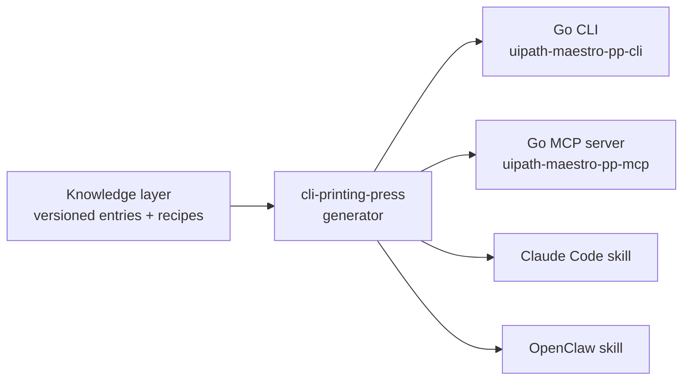

# pp-uipath-maestro — a living knowledge-and-validation layer for UiPath Maestro Case

## Summary

A printing-press-generated, open-source developer toolkit that exposes the undocumented UiPath Maestro Case / Data Fabric / Action Center behaviors this project discovered. One define-once source emits four artifacts — a Go CLI, a Go MCP server, a Claude Code skill, and an OpenClaw skill — whose v1 is a credential-free, CI-runnable validation suite backed by a version-stamped knowledge layer and an error-code oracle. Built to be genuinely adopted (the hackathon is the launch), not just a submission artifact.

## Problem Frame

UiPath Maestro Case is young (GA April 2025; Case newer; every Maestro skill in `github.com/UiPath/skills` is still marked "In-development") and churns monthly, so it mints undocumented footguns faster than they get fixed. The orchestration tier *above* the canvas is unserved by official tooling: the coding-agent MCP exposes a single catch-all `run_command` shell rather than typed tools, and UiPath's own skills are demonstrably broken in this domain (issues #333/#337 namespace bugs, #334 curl-bypass). This project hit and solved a dense set of these — caseplan `.bpmn` staleness, spawn fan-out failures, Data Fabric silent field-drops, Action Center gate-deletion faults — but the knowledge lives in five disjoint scripts and a feedback doc. Any UiPath developer building agentic Maestro Case solutions hits the same walls today with no installable help and error codes that return zero search results.

## Key Decisions

- KD1. **Primary actor is a real adopted dev tool.** The audience is UiPath developers building agentic Maestro Case solutions (and the coding agents driving them). The AgentHack submission is the launchpad, not the ceiling — scope and durability decisions favor lasting usefulness over one-time scoring.
- KD2. **Identity is a living knowledge-and-validation layer**, framed as "shellcheck + tldr + DefinitelyTyped for Maestro Case" — not a bag of wrappers around today's bugs.
- KD3. **The durable bet is curation quality + validation rigor + trust** — not the current bug list (UiPath will fix individual gaps; #333 already has a fix PR) and not agent-native distribution (commoditized; the "ClawHavoc" malware incident shows trust is the real gate). Because UiPath iterates its own skills repo fast and could absorb a thin wrapper (the TSLint precedent), durability comes from out-curating on coverage/freshness and owning the offline CI shift-left position the vendor's runtime-first tooling structurally under-serves (the shellcheck/tflint precedent).
- KD4. **v1 shape: knowledge-layer spine, validator face, operators deferred.** Ship the version-stamped knowledge layer + error oracle, expressed primarily as a credential-free CI validator suite. Defer the auth-requiring operators (`safe_gate_action`, `complete_apptask`, `reconcile_case_jobs --sweep`) to v2 — they need a live tenant, raise the IP/safety surface, and are the least durable per-tool.
- KD5. **Build mechanism: the `cli-printing-press` generator emits all four artifacts from one source.** The linked `printing-press-library` repo is the catalog/installer; the sibling `cli-printing-press` is the generator. Go 1.26.3+ and Node 20+ become toolchain prerequisites — authorized by this decision (a deliberate departure from the pure-Python build tooling, scoped to this separate toolkit).
- KD6. **Freshness is handled by version-stamping every entry.** Each footgun/recipe records the platform/CLI version it was proven on and a `resolved-in` field, so a fixed gap self-deprecates into history rather than misinforming — turning the freshness risk into a feature.

## Requirements

**Knowledge layer (the spine)**

- R1. Every footgun, error code, and recipe is a versioned entry stamped with the platform/CLI version it was proven on and an optional `resolved-in` field; resolved entries surface as history, not active guidance.
- R2. An error-code oracle: given a raw UiPath error signature (e.g. `400300`, `160009`, `170015`, "still being indexed"), it returns the proven cause and fix from the local store — offline and credential-free.
- R3. Entry content is sourced from the project's verified inventory (`docs/submission/PRODUCT-FEEDBACK.md` and the existing point-wrappers) and is IP-safe — no real vendor names, passing the forbidden-token denylist in `CLAUDE.md`.

**v1 tool surface — credential-free static validation**

- R4. `validate_caseplan`: static V20 lint of a caseplan on disk — `.bpmn` staleness (mtime newer than `caseplan.json`), missing mainline start event, duplicate auto-added `error` outputs, dropped HITL bindings, V20 expression-prefix errors — plus a `restore` mode for the known deterministic canvas drops. No UiPath login required.
- R5. `check_spawn_fanout`: flags runtime-failing expressions (`=datafabric.qem:` → `400300`) in spawn inputs before deploy. Credential-free.
- R6. `validate_df_entity`: catches the underscore silent-drop and reserved-`id` traps in a Data Fabric entity/field spec and suggests camelCase rewrites. Credential-free.
- R7. Every tool emits agent-native structured output (`--json` / `--agent`) and exits non-zero on findings, so it runs unattended as a CI gate.

**Generation and artifacts**

- R8. The four artifacts — Go CLI (`uipath-maestro-pp-cli`), Go MCP server (`uipath-maestro-pp-mcp`), Claude Code skill (`/pp-uipath-maestro`), and OpenClaw skill — are generated from one printing-press source, so a fix is a one-edit, all-re-emit change.
- R9. The artifacts are produced via the `cli-printing-press` generator, not hand-written Go; the knowledge layer is the source the generator consumes.

**Distribution and trust**

- R10. Published as a discoverable catalog entry installable across coding-agent harnesses with one command (`npx skills add …` / `clawhub install …`).
- R11. Community-contributable from day one: a documented entry schema plus an automated IP-safety and validation gate on every contribution, so curation and trust — not the distribution channel — carry the moat.

**Hackathon integration**

- R12. A contribute-back PR to UiPath's broken official skills (#333/#337 namespace, #334 curl-bypass), with a fallback to extending coverage or tests if fix PR #399 is already merged.
- R13. A README + DEVPOST "Open-Source Tooling / Contributing Back" section with install commands and a gap→tool table, filling the currently-empty C4 "Tooling" component-variety row and supporting the +2 coding-agent bonus.

## Success Criteria

- **By Jun 29 (submission):** v1 installable with one command; `validate_caseplan` and the error oracle work credential-free and demo live (catch a `400300` or a stale `.bpmn` before deploy); the four artifacts are generated from one source; the README/DEVPOST callout is live; the contribute-back PR is open.
- **Adoption (post-deadline):** catalog presence and real installs; a merged UiPath PR; at least one external contribution accepted through the IP-safe contribution gate; entries stay version-current as Maestro evolves.

## Scope Boundaries

**Deferred for later (v2)**

- Auth-requiring operators: `safe_gate_action`, `complete_apptask`, `reconcile_case_jobs --sweep`.
- Generalizing caseplan `restore` beyond the known deterministic canvas drops.

**Outside this product's identity**

- A general-purpose UiPath CLI competing with the official `uip`.
- Anything that replaces the Maestro Case canvas as the orchestrator, or executes/drives cases at runtime.
- Shipping real tenant data or any non-fictional names in entries or examples.

## Dependencies / Assumptions

- Requires the `cli-printing-press` generator, Go 1.26.3+, and Node 20+; generation runs as an agent loop, not a one-shot CLI.
- **Load-bearing assumption (verify early):** `cli-printing-press` can generate from a curated knowledge/spec source rather than only from a live API, website, or HAR capture. The whole "generate via printing-press" approach depends on this — see Outstanding Questions.
- Issue #333 fix PR #399 may already be merged; the contribute-back move has a coverage-extension fallback.
- **Risk:** UiPath absorbs the validation layer into its fast-moving first-party skills (TSLint precedent). Mitigation: out-curate on coverage/freshness and own the offline credential-free CI position.
- IP-safety is ZERO TOLERANCE for all shipped tool text and examples (`CLAUDE.md` denylist; `/audit-ip-safety`).

## Outstanding Questions

**Resolve before planning**

- Can `cli-printing-press` generate the Go CLI + MCP + skills from a hand-authored knowledge/spec source (not an API/website/HAR)? Spike this first — it gates R8/R9. If it cannot, the fallback is to hand-author the `SKILL.md` as source of truth and reach the CLI/MCP either through the generator's patch/AST-injection mode or a polyskill-style `targets → dist/<adapter>` emit, keeping the define-once principle.

**Deferred to planning**

- The exact knowledge-entry schema and the version-stamp/`resolved-in` field shape.
- Where the toolkit lives (separate repo vs. a subdir of this one) and how its Go/Node toolchain is isolated from the pure-Python build tooling.
- CI wiring for the validator suite and the contribution IP-safety gate.

## Sources / Research

- Ideation artifact: `docs/ideation/2026-06-16-printing-press-uipath-tooling-ideation.html` (7 ranked directions; this is idea #1).
- Discovered-behavior inventory: `docs/submission/PRODUCT-FEEDBACK.md`; point-wrappers `scripts/merge-canvas-download.py`, `demo_autocomplete.py`, `scripts/seed_data_fabric.py`, `src/cascadecare/` `maestro_client.py`, `agents/case-job-janitor/`.
- printing-press: `https://printingpress.dev/`, generator `https://github.com/mvanhorn/cli-printing-press`, catalog `https://github.com/mvanhorn/printing-press-library`.
- UiPath gaps: `https://github.com/UiPath/skills` issues #333, #334, #337; CLI MCP `run_command` shell at `https://docs.uipath.com/uipath-cli/standalone/latest/user-guide/uip-mcp`.
- Durability precedents (Tavily-corroborated 2026-06-16): DefinitelyTyped, tldr-pages, shellcheck/tflint CI shift-left; TSLint deprecation as the vendor-absorption counter-example; Agent Skills cross-harness standard and the ClawHavoc trust incident.
