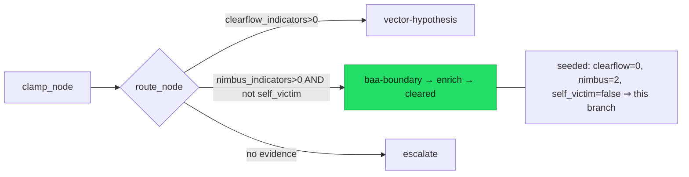
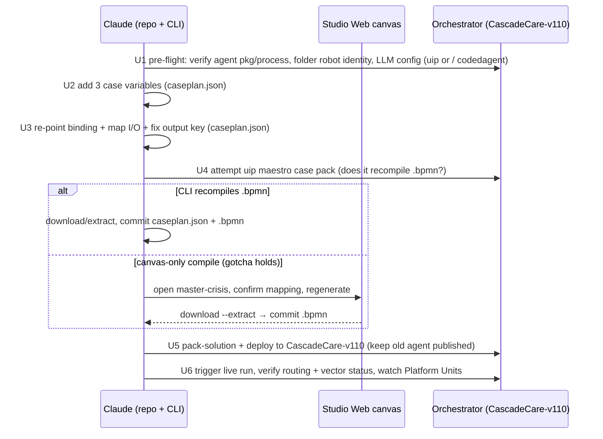

# feat: Replace Function-type `forensic-self-exam-agent` with the LangGraph Agent in the master-crisis caseplan

## Summary

Swap the active forensic agent in the `clearflow-master-crisis` caseplan from the Function-type
`forensic-self-exam-agent` to the Agent-type `forensic-self-exam-agent-langgraph` (uipath-langchain
LangGraph), wire the agent's three evidence inputs from new case variables so its conditional
routing is actually exercised, regenerate the compiled `.bpmn`, and redeploy to
`Shared/CascadeCare-v110`. Maestro Case remains the orchestrator; this changes one task's bound
agent and its I/O mapping.

---

## Problem Frame

The LangGraph conversion was deployed and proven live as a standalone job (prior session), but it is
**not wired into the demo** — the `clearflow-master-crisis` caseplan still binds the original
Function-type `forensic-self-exam-agent`. The prior plan
(`docs/plans/2026-06-14-001-...-integration-plan.md`) explicitly **deferred** the caseplan wiring as
a future slice. This plan is that slice.

Research (`docs/research/2026-06-14-platform-units-langgraph-research.md`) resolved the open
licensing/runtime question: **Platform Units power the Agent cleanly** (~0.4 PU/run; the 10K pool is
~14× the full demo's need; Heals/ScreenPlay are irrelevant), and the folder already runs Agent-type
processes, so **no runtime provisioning is needed**. The work is therefore **engineering-gated, not
budget-gated**. The risks are mechanical: the Function→Agent I/O-contract swap (Maestro strictly
validates inputs against `entry-points.json`), the `.bpmn` recompile (historically canvas-only), and
the binding/resource resolution.

Two scope decisions were confirmed with the user:
1. **Keep the original Function agent published but un-wired** as a hot rollback fallback (do not retire it).
2. **Wire the case's evidence variables into the agent's 3 inputs** so the LangGraph routing is exercised in the demo (not a zero-input placeholder swap).

---

## Requirements

1. **R1 — Active swap.** The `Forensic Self-Examination` task (`tFSEXam01`, Reversal 2 / Day 5 stage) in `clearflow-master-crisis` invokes `forensic-self-exam-agent-langgraph` at runtime, not the Function-type agent.
2. **R2 — Input wiring.** The task passes the agent's three inputs (`clearflow_indicators:int`, `nimbus_indicators:int`, `clearflow_self_victim:bool`) sourced from case variables, seeded to the Reversal-2 narrative ("ClearFlow cleared, Nimbus is the vector") so routing resolves deterministically to the `baa-boundary` / `cleared` branch.
3. **R3 — Output parity.** The task reads the agent's `clearflow_vector_status` output (snake_case — the LangGraph key) into `var_clearflow_vector_status`, replacing the current `=ClearFlowVectorStatus` (PascalCase, the Function agent's key).
4. **R4 — Compiled `.bpmn` reflects the swap.** The runtime-executed `caseplan.json.bpmn` carries the new binding + I/O, committed to the repo (not just the canonical `caseplan.json`).
5. **R5 — Deployed + verified live.** The change is deployed to `Shared/CascadeCare-v110` and a live master-crisis run confirms the LangGraph agent executes, routes correctly, and sets the vector status; the case proceeds past the stage.
6. **R6 — Rollback ready.** The original `forensic-self-exam-agent` process remains published and un-wired; a documented one-binding revert restores it.
7. **R7 — Green gates.** `uv run pytest && uv run mypy src/` pass; `/audit-ip-safety` passes (no forbidden tokens); no other caseplan or agent is modified.

---

## Key Technical Decisions

**KTD-1: Re-point the binding in the caseplan's own `bindings` array — there is no `resources/` registration to edit.**
The forensic coded agents are deployed **separately** via `uip codedagent` (confirmed in `scripts/pack-solution.sh` header) and are **not** solution-manifest projects. The agent reference lives entirely in the caseplan's `bindings` entries `bFSEDaNm7` (name) and `bFSEDaFp8` (folderPath), both `resourceSubType:"Agent"`, `resourceKey:".forensic-self-exam-agent"`. The swap edits those two entries → `forensic-self-exam-agent-langgraph`. The "hand-edit `resources/` bindingType after pack" gotcha (memory: caseplan-canonical-vs-packsolution) does **not** apply here because the agent is not a manifest project — but the caseplan project *is*, so it still flows through `pack-solution.sh`.

**KTD-2: Wire inputs via 3 new case variables, not literal task defaults.**
The user asked for case-variable wiring (vs. the literal-`default` pattern the BAA task `tNWPCipI7` uses). Add three entries to `variables.inputOutputs[]` (`var_clearflow_indicators`, `var_nimbus_indicators`, `var_clearflow_self_victim`) mirroring the existing object shape, then bind the task's three inputs to them with `=vars.<id>` expressions. This puts evidence in case state (visible in the Case App, settable by upstream stages), which is the demo-meaningful interpretation. The exact input-binding field shape (whether inputs carry `source:"=vars.x"` like outputs, or an expression in `value`) is verified during U4 against the canvas/V20 schema — the canvas Properties panel writes the canonical shape.

**KTD-3: Seed evidence to the Reversal-2 narrative (deterministic demo).**
The forensic task runs in the "Reversal 2 (Day 5): ClearFlow cleared. Nimbus identified as vector" stage. Seed `clearflow_indicators=0`, `nimbus_indicators=2`, `clearflow_self_victim=false` → the LangGraph graph routes `route_to="baa-boundary"`, `clearflow_vector_status="cleared"`, matching the narrative. Determinism over realism: judging needs a repeatable outcome.

**KTD-4: Fix the output source key (`ClearFlowVectorStatus` → `clearflow_vector_status`).**
This is the concrete schema mismatch the research flagged. The LangGraph `entry-points.json` emits `clearflow_vector_status`; the task's output mapping `source` must match exactly or Maestro returns `Agent.InputArgumentsSchema / Required properties not present` (input side) / silently drops the output (output side). Keep the `target` (`=vars.var_clearflow_vector_status`) unchanged.

**KTD-5: Prefer CLI for the compile/deploy path; fall back to the canvas only for `.bpmn` regen if required.**
`uip maestro case` (CLI 1.195.0) exposes `tasks`/`stages`/`edges` JSON editors plus `pack` and `process`. **Open question (U4):** whether `uip maestro case pack` regenerates the compiled `.bpmn` from the edited JSON. If yes, the whole swap is CLI-driven. If no, the canvas-only compile-gotcha (memory: caseplan-bpmn-compile-gotcha) holds and the regen is the one browser step. Robot-identity check and deploy/activate are CLI (`uip or folders`/`machines`, `uip solution` / `uip maestro case process`), per the user.

**KTD-6: Keep the original agent as a hot fallback (R6).** Do not delete the `forensic-self-exam-agent` package/process. Rollback = revert the two binding entries, recompile `.bpmn`, redeploy — minutes, not a rebuild.

---

## High-Level Technical Design

### Current vs. target wiring

```
CURRENT (Function-type, placeholder):
  caseplan binding  .forensic-self-exam-agent  ──▶  Function process "forensic-self-exam-agent" (main)
  task tFSEXam01    inputs: []                                       outputs: [ClearFlowVectorStatus → var_clearflow_vector_status]

TARGET (Agent-type, routing exercised):
  caseplan binding  .forensic-self-exam-agent-langgraph  ──▶  Agent process "forensic-self-exam-agent-langgraph" (graph)
  case vars         + var_clearflow_indicators=0, var_nimbus_indicators=2, var_clearflow_self_victim=false
  task tFSEXam01    inputs:  clearflow_indicators ◀=vars.var_clearflow_indicators
                            nimbus_indicators     ◀=vars.var_nimbus_indicators
                            clearflow_self_victim ◀=vars.var_clearflow_self_victim
                    outputs: clearflow_vector_status → var_clearflow_vector_status
```

### Routing exercised by the seeded inputs



### Execution flow (responsibility split)



---

## Implementation Units

### U1. Pre-flight verification (CLI, no edits)

**Goal:** Confirm the swap's preconditions before touching the caseplan, so a failure surfaces early.
**Requirements:** R5, R6 (preconditions).
**Dependencies:** none.
**Files:** none (read-only CLI).
**Approach:**
- Confirm the package + process exist in the target folder: `uip or packages list` / `uip or processes` filtered to `forensic-self-exam-agent-langgraph` in `Shared/CascadeCare-v110` (Orchestrator screenshot shows Agent (python) v0.1.0 present — re-confirm by name).
- Confirm folder unattended-robot identity / serverless machine: `uip or folders` + `uip or machines` for `Shared/CascadeCare-v110` (existing Agent-type processes imply it; confirm explicitly).
- Note the LLM-config metering shape: `uip llm-configuration` (UiPath-hosted vs BYOM) — billing precision only, not blocking.
- Confirm the original `forensic-self-exam-agent` process is present (fallback exists).
**Test scenarios:**
- Verification: `forensic-self-exam-agent-langgraph` resolves as an Agent process in the folder; folder has a robot identity; original Function process still present. Any missing precondition halts the slice (stop-and-ask).
**Verification:** All four checks pass and are recorded; otherwise stop.

---

### U2. Add three evidence case variables

**Goal:** Introduce the case state that drives the agent's inputs.
**Requirements:** R2.
**Dependencies:** U1.
**Files:** `maestro_case/clearflow-master-crisis/caseplan.json` (modify).
**Approach:** Append three objects to `variables.inputOutputs[]`, mirroring the existing shape (`{id,name,type,custom:true,elementId:"root",default}`):
- `var_clearflow_indicators` — integer, default `0`
- `var_nimbus_indicators` — integer, default `2`
- `var_clearflow_self_victim` — boolean, default `false`

Names follow the existing `var_*` / PascalCase `name` convention (e.g., `ClearFlowIndicators`). These defaults encode the Reversal-2 narrative (KTD-3).
**Patterns to follow:** the existing `var_clearflow_vector_status` / `var_reversal_number` entries in the same `inputOutputs` array.
**Test scenarios:**
- `test_caseplan_structure.py` still parses the caseplan; the three new variables are present with correct types. Extend that test (or add one) to assert the three evidence variables exist.
- Covers R2: variables exist and are typed (int/int/bool).
**Verification:** `uv run pytest tests/unit/maestro_case/test_caseplan_structure.py` green; caseplan is valid JSON.

---

### U3. Re-point the binding and re-map the task I/O

**Goal:** Make `tFSEXam01` bind and call the LangGraph agent with wired inputs and the corrected output key.
**Requirements:** R1, R2, R3.
**Dependencies:** U2.
**Files:** `maestro_case/clearflow-master-crisis/caseplan.json` (modify).
**Approach:**
1. **Bindings** (`bindings[]`): in `bFSEDaNm7` set `default` and `resourceKey` to `forensic-self-exam-agent-langgraph` / `.forensic-self-exam-agent-langgraph`; in `bFSEDaFp8` set `resourceKey` to `.forensic-self-exam-agent-langgraph`. Keep `resourceSubType:"Agent"`.
2. **Task inputs** (`tFSEXam01.data.inputs`): add three entries mirroring the BAA task (`tNWPCipI7`) input object shape, one per agent input (`clearflow_indicators`, `nimbus_indicators`, `clearflow_self_victim`), each bound to its case variable via a `=vars.var_*` expression (exact field confirmed in U4). Types must match `entry-points.json` (integer/integer/boolean), and each input object carries `elementId:"Stage_TJUXJV-tFSEXam01"` (BAA input pattern) — this preserves the `test_caseplan_structure.py` task-`elementId` invariant.
3. **Task output** (`tFSEXam01.data.outputs[0]`): change `source` from `=ClearFlowVectorStatus` to `=clearflow_vector_status`; keep `target:"=vars.var_clearflow_vector_status"` and `type:"string"` (KTD-4).
4. **Description:** replace the "DEPLOY-TIME PLACEHOLDER" note with text reflecting the LangGraph agent and the exercised routing.
**Patterns to follow:** BAA task `tNWPCipI7` (Agent-type task *with* inputs); existing output mapping shape in `tFSEXam01`.
**Test scenarios:**
- Covers R1: the caseplan's forensic binding resourceKey/name equals `forensic-self-exam-agent-langgraph`.
- Covers R3: the task output `source` equals `=clearflow_vector_status`.
- Covers R2: the task has exactly three inputs, typed int/int/bool, each referencing a `var_*` evidence variable.
- Edge: input types match `agents/forensic-self-exam-agent-langgraph/entry-points.json` exactly (a string-vs-int drift would fail Maestro schema validation live).
- `uv run pytest` stays green. `test_dashboard.py` asserts a **static** 7-agent dashboard payload (incl. `forensic-self-exam-agent`) that is **independent of the caseplan** — the swap does not break it and no change is needed here (dashboard truthfulness update is deferred). `test_caseplan_structure.py` invariants are preserved (variables stay object-shaped; task `elementId` unchanged).
**Verification:** caseplan parses; the three assertions above hold; full suite green.

---

### U4. Recompile the `.bpmn` and sync to the repo

**Goal:** Produce a compiled `caseplan.json.bpmn` that carries the new binding + I/O (the artifact the runtime actually executes).
**Requirements:** R4.
**Dependencies:** U3.
**Files:** `maestro_case/clearflow-master-crisis/caseplan.json` (sync), `maestro_case/clearflow-master-crisis/caseplan.json.bpmn` (regenerate + commit).
**Approach:**
- **First attempt (CLI):** run `uip maestro case pack` (and inspect whether it regenerates `.bpmn` from the edited JSON). If the packed `.bpmn` reflects the new `resourceKey="forensic-self-exam-agent-langgraph"` and the wired inputs, the path is fully CLI-driven — extract and commit.
- **Fallback (canvas):** if `pack` does not recompile (the compile-gotcha holds), open `clearflow-master-crisis` in the Studio Web canvas, confirm the agent re-points and the input/output mapping in the Properties panel (this also resolves KTD-2's exact input-binding shape), regenerate, then `download --extract` and commit both files.
- Either way, **commit the fresh `.bpmn`** — a stale `.bpmn` makes the swap inert (memory: caseplan-bpmn-compile-gotcha).
**Test scenarios:**
- Covers R4: `caseplan.json.bpmn` contains `resourceKey="forensic-self-exam-agent-langgraph"` (and no longer the bare `.forensic-self-exam-agent` for this task).
- `test_bpmn_case_binding.py`: **not affected** — it validates the BPMN→case *spawn* binding (`clearflow-master-crisis`) against solution **process** resources (`resources/solution_folder/process/**`), not the forensic *agent* binding (coded agents aren't solution resources). Confirmed by reading the test; no change needed.
- `test_bpmn_structure.py`: master-crisis structural assertions still hold.
**Verification:** `.bpmn` shows the new resourceKey + wired I/O; `uv run pytest tests/unit/maestro_bpmn/` green.

---

### U5. Pack and deploy to `Shared/CascadeCare-v110` (keep fallback)

**Goal:** Ship the updated caseplan to the live folder without removing the rollback target.
**Requirements:** R5, R6.
**Dependencies:** U4.
**Files:** `maestro_case/clearflow-solution/**` (regenerated by the pack script — do not hand-edit).
**Approach:**
- `bash scripts/pack-solution.sh` to refresh the solution package from canonical sources, then deploy via the proven recipe (memory: slice023-clean-deploy-v104 / v105): `uip solution` pack → publish → deploy to the `Shared/CascadeCare-v110` folder, bumping the version. Confirm whether a per-process update via `uip maestro case process` is sufficient as a lighter alternative.
- **Do not** delete or unpublish `forensic-self-exam-agent` (R6). If a version bump is needed for the langgraph agent, `uip codedagent deploy` (one-shot pack+publish) — but it is already published v0.1.0, so likely no-op.
**Test scenarios:**
- Verification (live): the deployed master-crisis process version increments; the folder shows the updated case definition; the original Function agent process is still listed.
- Pre-deploy gate: `uv run pytest && uv run mypy src/` green; `/audit-ip-safety` clean.
**Verification:** deployment succeeds; both agents present in the folder; gates green.

---

### U6. Live verification + rollback drill

**Goal:** Prove the swap works end-to-end and that revert is fast.
**Requirements:** R5, R6.
**Dependencies:** U5.
**Files:** none (live ops; optional notes to `docs/`).
**Approach:**
- Trigger a `clearflow-master-crisis` instance (`uip maestro case instance` / `job`, or the demo driver). Advance to the Reversal-2 / "Forensic Self-Examination" stage.
- Confirm: a job runs for `forensic-self-exam-agent-langgraph` (not the Function agent); it routes to `baa-boundary` with `clearflow_vector_status="cleared"`; `var_clearflow_vector_status` updates; the stage completes and the case proceeds.
- Watch **Admin → Licenses → Consumables** (`uip or licenses`) — expect a per-run draw of ~0.4 PU; full demo well within 10K (research §5).
- **Rollback drill (documented, not necessarily executed):** revert `bFSEDaNm7`/`bFSEDaFp8` to `.forensic-self-exam-agent`, recompile `.bpmn`, redeploy — confirm the steps are written down and the fallback process is reachable.
**Test scenarios:**
- Covers R5 (acceptance): live run shows the LangGraph agent invoked and routing exercised to the `cleared` branch; case advances past the stage.
- Covers R6: rollback steps are documented and the original process is confirmed runnable.
- Failure path: if the live agent task errors on schema (`Agent.InputArgumentsSchema`), the input types/keys in U3 are wrong — fix and re-deploy before proceeding.
**Verification:** one clean live run end-to-end through the forensic stage; PU draw observed and within budget; rollback documented.

---

### U7. Docs, gates, and memory

**Goal:** Record the now-active integration and keep guardrails green.
**Requirements:** R7.
**Dependencies:** U6.
**Files:** `docs/plans/2026-06-14-001-feat-langgraph-agent-integration-plan.md` (note the deferral is now resolved — optional), `README.md` / `CLAUDE.md` if they assert the active forensic agent, this plan's status via git.
**Approach:**
- Update any doc that names `forensic-self-exam-agent` as the active forensic agent in the case (README naming table, dashboard agent list if applicable).
- Run `/audit-ip-safety` (no forbidden tokens; all names from the committed fictional table).
- Confirm `test_readme_completeness.py` and `test_consistency.py` still pass with any doc edits.
**Test scenarios:**
- `uv run pytest && uv run mypy src/` green; `/audit-ip-safety` passes.
- Covers R7: no other caseplan/agent modified (git diff scoped to master-crisis + solution package + docs).
**Verification:** all gates green; diff scoped as expected.

---

## Scope Boundaries

### In scope
- `maestro_case/clearflow-master-crisis/caseplan.json` (+ compiled `.bpmn`): binding swap, 3 new variables, task I/O re-map.
- Solution repack + deploy to `Shared/CascadeCare-v110`.
- Tests touching the caseplan/agent surface; docs naming the active agent.

### Deferred to Follow-Up Work
- Agent evaluation set (`evaluations/`) for the LangGraph agent (the other coded agents have eval sets; this one does not yet).
- Converting additional agents to LangGraph.
- Promoting the seeded literal/variable evidence to upstream-stage-driven values (dynamic evidence across reversals) beyond the Reversal-2 deterministic seed.
- Update the dashboard Coded Web App agent feed (and `test_dashboard.py`) to show `forensic-self-exam-agent-langgraph` as the active forensic agent — truthfulness/polish, separate `uip codedapp` deploy.

### Outside scope
- The other two caseplans (`clearflow-stakeholder-parent`, `clearflow-obligation-grandchild`) — they do not bind this agent.
- Changes to the LangGraph agent's code (already published v0.1.0, schema-compatible).
- AgentService/runtime provisioning (already available in-folder).
- Retiring the original `forensic-self-exam-agent` (kept as rollback per R6).

---

## Open Questions

1. **Does `uip maestro case pack` recompile the `.bpmn`?** (U4) If yes → fully CLI path; if no → canvas regen is the one browser step (compile-gotcha holds). Resolve by inspection at implementation.
2. **Exact input-binding field shape in V20** (U3/KTD-2): do task inputs bind to case vars via `source:"=vars.x"` (like outputs) or an expression in `value`? The canvas Properties panel writes the canonical shape; confirm there, or against a known Agent-input-with-binding example if one exists on the tenant.
_Resolved during planning (read the tests directly):_
- **`test_bpmn_case_binding.py`** validates only the BPMN→case *spawn* binding against solution process resources — it does not touch the forensic agent binding, so the swap leaves it green.
- **`test_dashboard.py`** asserts a static dashboard payload independent of the caseplan — the swap leaves it green; updating the dashboard to show the LangGraph agent is deferred polish.
- **`test_caseplan_structure.py`** stays green provided variables remain object-shaped and the task `elementId` is preserved (U2/U3 do both).

---

## Risks & Mitigations

| Risk | Likelihood | Impact | Mitigation |
|---|---|---|---|
| Input/output schema mismatch fails the live agent task (`Agent.InputArgumentsSchema`) | Medium | High (demo-breaking) | U3 types match `entry-points.json` exactly; U4 maps via canvas Properties panel; U6 dry-run before relying on it |
| Stale compiled `.bpmn` → swap silently inert | Medium | High (silent) | U4 commits a freshly recompiled `.bpmn`; `test_bpmn_case_binding`/`structure` assert the new resourceKey |
| `.bpmn` recompile requires the browser canvas (CLI can't) | Medium | Medium (one manual step) | U4 CLI-first with explicit canvas fallback; not demo-breaking either way |
| Deploy disrupts the live folder mid-rehearsal | Low | Medium | Version bump; keep original agent published (R6); rollback drill in U6 |
| Platform Unit exhaustion | Very low | Low | Research §5: ~600–700 PU full demo vs 10K; monitor `uip or licenses` |
| IP-safety regression in new descriptions/vars | Low | High (blocks commit) | U7 `/audit-ip-safety`; reuse committed fictional names only |

---

## Sources & Research

- `docs/research/2026-06-14-platform-units-langgraph-research.md` — Platform Units verdict, consumption model, integration implications, budget math, ranked risks (4-agent tavily/exa/ref/context7 synthesis).
- `docs/plans/2026-06-14-001-feat-langgraph-agent-integration-plan.md` — prior slice (SDK conversion); this plan resolves its deferred caseplan-wiring item.
- Repo grounding: `maestro_case/clearflow-master-crisis/caseplan.json` (bindings 171–189, task `tFSEXam01` ~2267, `variables.inputOutputs` ~308); BAA task `tNWPCipI7` (Agent-input pattern); `agents/forensic-self-exam-agent-langgraph/entry-points.json` (I/O schema); `scripts/pack-solution.sh` (coded agents deployed separately); `uip` CLI 1.195.0 (`or`, `maestro case`, `codedagent`, `solution`).
- Institutional learnings (auto-memory): caseplan-bpmn-compile-gotcha, caseplan-canonical-vs-packsolution, slice023-clean-deploy-v104/v105 deploy recipe.
